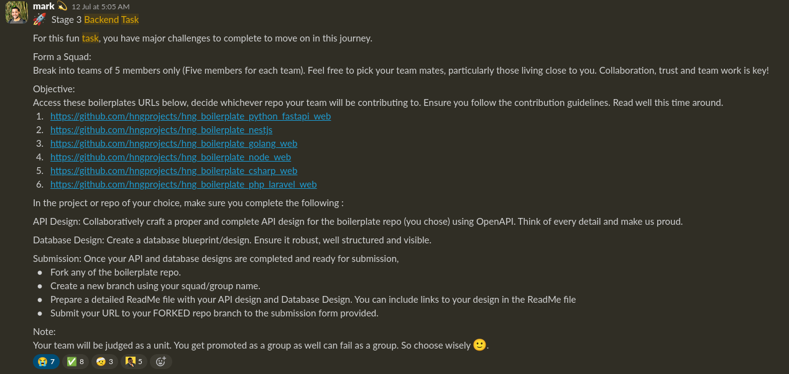

If you are familiar with the Nigerian Tech Space, then you should have heard about HNG by now. It's a 2-month intensive program where thousands of people from around the world (mostly Nigerians) come together to put their skills to the test. There are 10 stages in HNG. Each week, you are given a task that you must complete to move on to the next stage. To qualify as a finalist, you must make it to stage 10. HNG offers different tracks to choose including Backend, Frontend, Data Analysis, etc. You can choose multiple tracks if you're confident you can handle the workload. I chose the Backend track.

For HNG 11, I joined a Slack Workspace with 16,000+ other humans. We were added to the Stage 0 channel where we were given our first task. For Stage 0, the interns in the backend track were asked to write an article detailing a recent backend problem we solved. Our [submission](sk-experience.md) must contain at least two back links to HNG internship websites. The tasks in stage 0-1 were easy enough. I mean, the bar was low (for me), so I was able to breeze past them. 

In Stage 1, I had to set up a web server that exposes an API endpoint that will return the following JSON when a **GET** request is made to `/api/hello?vistor_name="Mark"`. 

```json
{
  "client_ip": "127.0.0.1", // The IP address of the requester
  "location": "New York", // The city of the requester
  "greeting": "Hello, Mark!, the temperature is 11 degrees Celcius in New York"
}
```

## Trouble Began In Stage 2 
Based on the [instructions](https://github.com/daviduzondu/hng-stage-2/blob/master/INSTRUCTIONS.md) for the Stage 2 task, we were supposed to setup PostgreSQL and connect our application to the database server. Now, prior to this, I had never used PostgreSQL (or any other relational database). The only database system I was "experienced" in up to that point was MongoDB, because for some stupid reason I was scared of SQL. Since Postgres was specifically mentioned in the instructions, I had no choice than to download and install it on my machine.

The instructions also stated that we were allowed to use an ORM, but I chose to raw-dog SQL because I thought it'd be a great learning experience. For the database driver, I went with the [pg](https://npmjs.com/package/pg) package. From there things were a bit easier, I was familiar with Express so creating the API was not difficult at all. I hit another road block when it came to unit testing. Before Stage 2, I had never written tests for my code before. Ever! I just pushed my code to prod and pray to God that everything works. 

I had to learn about unit testing overnight, and if you take a look at my code, it's pretty obvious that it was written by someone who had never written a unit test in their life. Either way, I scored a 7/10 for this stage and I was promoted to stage 3 [^1].
## Collaborating With Other Interns
Trust me when I say this, the most difficult part of HNG is not coding. It's the collaboration/communication. I mean sure, if you are new to programming, you're probably NGMI, but if you know how to read and understand instructions, and you have good **communication** skills, you shouldn't have much of a problem going through the program. 

A lot of times, you'll be assigned a task with "cryptic" instructions, it is your job to decode what the instruction says as much as you can. The mentors are not always available (especially at the early stages of the program). Tens of thousands of people sign up for HNG every year, so you're competing with thousands of other confused interns for the attention of a mentor. 

Stage 3 was where collaboration began. We were supposed to group ourselves (five interns per group) and work on an API and Database design. The instructions for this task was so confusing. Take a look at this: 


API Design based on what? What the hell does this even mean?

After a series of Google Meet calls and Slack Huddles, We learnt that there was another repository containing a [README file with better instructions](https://archive.ph/50bfm). I have no clue why this was never mentioned in the original Slack message. Anyways, I worked with 4 other interns to deliver the API design/documentation and database blueprint. We passed, so we were moved to Stage 4.
## Using a stack I was unfamiliar with
In Stage 4 we were supposed to create GitHub issues for the boilerplate repository we chose in the previous stage. Our issues would have to be approved before we can start working on them. Later in the stage, We were told that the Express repository was being discontinued and we should switch over to the Nest.js repository. 

Was I worried about deactivation because I didn't know shit about Nest? Yes, Yes I was. I remember joining the Nest.js channel confused as hell. I did not know what Nest.js was even works nor how it works. I guess I wasn't the only one uncomfortable with the change, because later, the mentors got feedback from the interns and decided to bring back Express.js into the program.

I genuinely did not think I was going to make it under the Nest.js team. I was not familiar with Nest.js and I didn't want to bring down the whole team. So I sent this message to one of the team leads.


I cannot think of a great caption for this

I quickly switched to Express.js but unfortunately when I joined, all the interesting tasks had been assigned other developers. So, I was assigned to one of the boring tasks—I had to write templates for the Email Systems with Handlebars. I did not enjoy that task. At all. 

Interns in HNG 11 were supposed to join a team handpicked by the Chief Mentor, and they were to deliver a working product (MVP) by the end of the program. Because of my bad experience with the Express.js team, I switched over to Nest.js (again). I know I keep mentioning Nest.js, but the official team name was "Team Starlight". 

Each team was supposed to have interns from different tracks like working to deliver the product. The backend developers on Team Starlight were using Nest.js (that's why I keep saying Nest.js). The team that had Express.js on their backend was Team Phoenix. 


Here I am begging to be let back into the team I left about a week earlier. 

The situation in the Express.js (Team Phoenix Backend) Slack channel was so at bad some point, that I was willing to switch over to Team Starlight and use a technology I hadn't touched before. After switching to Team Starlight, I got to work on the user data export feature for the boilerplate repo, "create & delete job listing" feature for Stage 5 and 6. It's quite surprising how quickly I picked up on Nest.js. I guess being in a team kind of helped because I could read the code my team mates wrote and try to learn from it.

When we got to Stage 7, we began to work on the core products we were supposed to deliver. Team Starlight was supposed to deliver [Remote Bingo](https://remote.bingo)—An online multiplayer game where people come together to play Bingo online.
## HNG11 was chaotic but fun
Stages 8 and 9 were hectic. We were fixing bugs, merging code, wondering why the multiplayer game isn't working, issuing fixes for the bugs the testers discovered, and questioning our existence. Stage 9 was interesting because, Mark told us that in this stage our individual work would not be graded and we would be graded as a team. 

If your product fails, then the whole team fails. We were in so...many....meetings...with the product managers. Was it stressful? Yes. Was it fun? Eh....Yes(?) Team members were jumping from Zoom meetings with the Chief Mentor, to Google Meet calls with the Product Managers, to Slack Huddles with team members. That's was what made HNG 11 fun for me. The constant anxiety whenever time for promotion to the next stage arrives. It was an experience like no other. 

## How it all ended
At the end of the program, we jumped on the final Google Meet call with the Chief Mentors and other mentors, and we showcased what we've been working on for the past few stages. We played the game LIVE, and showed that it worked. 


The moment it was announced that we won.

There were moments on that call where bugs in the game reared their ugly heads, but I don't think the mentors minded, because the bugs were not game breaking. What mattered what that we shipped a Minimum Viable Product and we showed that it worked. 

We were the first team to be promoted to finalist. I cannot tell you how happy I was when I got this message from the Slackbot. 


Phew

And just like that, I was a finalist! God! I learnt so much in this program. I learnt about backend development, creating PRs, writing good commit messages, a little bit about DevOps, and more. I interacted with so many good people, Lanfear, Asin Honore, Andrew, Codeghinux, Ismail and more. This may sound cliché, but HNG literally changed my life. I even got a shout out from one of the mentors. Do you know how good that felt? 


Check No. 4. 😏😏

I will be returning for HNG12. With the knowledge I have gathered now about the program, and with my improved skills, I don't think making it to at least Stage 6 would be a problem for me. But only time will tell. 


The moment Mark Essien confirmed that the weeks of suffering and pain was now over.

[^1]: I learnt how to write better unit tests after this event.